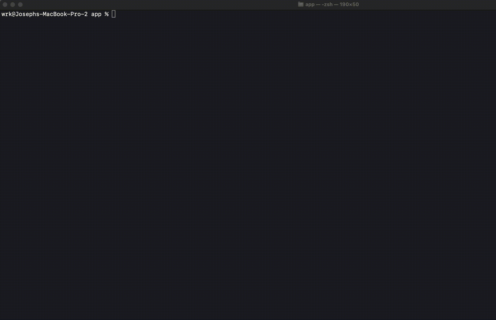

# Ollama API: A backend server to interact with Ollama and Stable Diffusion
Ollama is a fantastic software that allows you to get up and running open-source LLM models quickly alongside with Stable Diffusion this repository is the quickest way to chat with multiple LLMs, generate images and perform VLM analysis.  The complied code will deploy a Flask Server on your choice of hardware.


## Roadmap
- **Apache Support**:  We plan to support a production service API using WSGI 
- **Restful Support** Creating a quick RESTful deployment to query your favorite models with ease
- **Docker** Ensure deployment is seamless and simple using docker
- **API Route Documentation** Documentation to create your own interfaces or interactions with the backend service

## How to Run
1. Complete all the prequisite steps
2. Run the program `python3 app.py`


#### Interact with the server (UI)
We made this task as simple as possile using the powers of Replit and Valdi.  Valdi is our HPC provider which runs the backend and infrastucture to chat, generate images and perform VLM analysis.  Replit serves as a easy way to deploy our Modular UI to perform actions speciffic to the server.  You can easily fork our public UI on Replit to configure any changes but also interact with the backend service.  Only two steps are required:
1. Fork the UI on Replit
2. When prompted enter your IP Address into the secrets manager

[Modular LLM UI](https://replit.com/@bkr-studio/VALDI-LLMs-1?v=1)

#### Hardware Specs
Ensure that you have a machine with the following Hardware Specifications:
1. Ubuntu Linux or Macintosh (Windows is not supported)
2. 32 GB of RAM
3. 6 CPUs/vCPUs
4. 50 GB of Storage
5. NVIDIA GPU

#### Prerequisites
1. In order to run Ollama including Stable Diffusion models you must create a read-only HuggingFace API key.  [Creation of API Key](https://huggingface.co/docs/hub/security-tokens)
2. Upon completion of generating an API Key you need to edit the config.json located in the `./app/config.json`


3. Install neccessary dependencies and requirements: 

```sh
# Update your machine (Linux Only)
sudo apt-get update
# Install pip
sudo apt-get install python3-pip 
# Navigate to the directory containing requirements.txt
./app
# Run the pip install command
pip install -r requirements.txt
```
## Credits ✨
This project would not be possible without continous contributions from the Open Source Community.
### Ollama
[Ollama Github](https://github.com/jmorganca/ollama)

[Ollama Website](https://ollama.ai/)

### @cantrell
[Cantrell Github](https://github.com/cantrell)

[Stable Diffusion API Server](https://github.com/cantrell/stable-diffusion-api-server)

### Valdi
Our preferred HPC partner  🖥️

[Valdi](https://valdi.ai/)

[Support us](https://valdi.ai/signup?ref=YZl7RDQZ)

### Replit
Our preferred IDE and deployment platform  🚀

[Replit](https://replit.com/)

--
Created by [Dublit](https://dublit.org/) - Delivering Ollama to the masses
